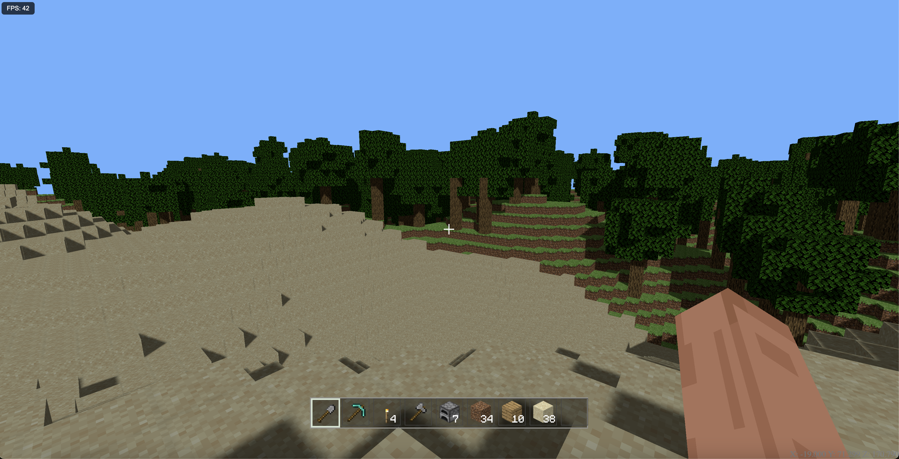

# minecraft-threejs

Réplique de **Minecraft** développée en **JavaScript** avec **Three.js**, incluant une architecture **client / serveur** et une gestion du monde par chunks.



---

## 🎮 Démo en ligne

👉 https://texier54.github.io/minecraft-threejs/

---

## 🕹️ Contrôles

### Déplacements
- **Z Q S D** → Avancer / Gauche / Reculer / Droite
- **Espace** → Sauter
- **Shift gauche** → Courir

### Interface & gameplay
- **E** → Inventaire
- **1 à 9** → Barre de raccourcis (slots)
- **T** → Afficher le chat
- **L** → Liste des joueurs
- **F5** → Changer de caméra
- **Échap** → Menu

---

## 🛠️ Développement (Client)

### Prérequis
- Node.js ≥ 18
- npm

### Lancer le projet en mode développement
```bash
npm install
npm run dev
```

Le client utilise **Three.js** pour le rendu 3D et gère :
- Le chargement dynamique des chunks
- Les entités (joueur, blocs interactifs, etc.)
- Les interactions (placement, destruction, portes, etc.)

---

## 🌍 Serveur

### Prérequis
- Node.js
- **PM2** (recommandé pour la production)

```bash
npm install -g pm2
```

### Rôle du serveur
Le serveur est responsable de :
- La synchronisation des joueurs
- La logique du monde
- La persistance des données

### Sauvegarde du monde
- Le monde est sauvegardé **par chunk**
- Format **binaire**
- Stockage dans le dossier :
```text
/worlddata
```

Chaque chunk est sauvegardé indépendamment afin d’optimiser les performances et la scalabilité.

## 🌍 Génération du terrain

La génération du terrain repose sur un système **procédural par chunks**, comme Minecraft.  
Elle combine **Simplex Noise**, **biomes**, **couches de blocs** et des éléments naturels comme la végétation, les ressources et les cavernes.

La génération est **déterministe** : avec une seed et des coordonnées identiques, un même chunk sera toujours généré de la même manière, côté client comme côté serveur.

---

### 🧱 Découpage en chunks

- Le monde est découpé en **chunks** de taille fixe (`chunkSize × chunkSize`) et d’une hauteur définie (`chunkHeight`)
- Chaque chunk contient une grille 3D de blocs
- Les chunks sont générés indépendamment mais utilisent des **coordonnées absolues** pour garantir une continuité parfaite entre eux

Ce découpage permet :
- un chargement dynamique du monde
- de bonnes performances
- une génération infinie du terrain

---

### 🌄 Relief et hauteur du terrain

Pour chaque position `(x, z)` d’un chunk, la hauteur du terrain est calculée à partir de **Simplex Noise** :

- Un bruit basse fréquence détermine le biome dominant
- Chaque biome possède ses propres paramètres (amplitude, échelle, hauteur moyenne)
- Une interpolation est appliquée entre biomes voisins afin d’éviter les transitions brutales

Le résultat est un terrain naturel, varié et fluide.

---

### 🌱 Biomes

Les biomes sont déterminés à partir d’un bruit normalisé entre `0` et `1`.

Exemples de biomes :
- ocean
- beach
- plains
- desert
- forest
- mountains

Chaque biome influence :
- la hauteur du terrain
- les blocs de surface
- la végétation
- la densité des arbres

---

### 🪨 Couches de blocs

La génération verticale respecte une logique simple :

- **Bedrock** à la base du monde
- **Stone** dans la majorité du sous-sol
- Une couche intermédiaire (terre, sandstone…) selon le biome
- Un bloc de surface (herbe, sable, neige…)
- De l’**eau** sous le niveau de la mer dans les biomes océaniques

---

### ⛏️ Ressources

Les minerais sont générés de manière procédurale à l’aide de bruit 3D :

- Chaque ressource possède un facteur de rareté
- Les ressources apparaissent uniquement dans la pierre
- La distribution est cohérente entre les chunks

Exemples de ressources :
- Charbon
- Fer
- Diamant

---

### 🌳 Végétation

La végétation est générée aléatoirement selon le biome :

- Forêts : forte densité d’arbres
- Plaines : densité modérée
- Montagnes : faible densité
- Déserts : cactus

Un arbre est composé d’un tronc vertical et d’une canopée générée autour de son sommet.

---

### 🕳️ Cavernes

Les cavernes utilisent un **bruit 3D combiné** afin d’éviter des tunnels trop linéaires :

- Génération de galeries irrégulières
- Cavernes élargies en poches sphériques
- Pas de cavernes trop proches de la surface
- Pas de cavernes dans la bedrock

À basse altitude, des poches de lave peuvent apparaître.

---

### 🔁 Déterminisme

Toute la génération repose sur :
- une **seed**
- des **coordonnées absolues**

Cela garantit :
- la cohérence du monde entre le client et le serveur
- la reproductibilité parfaite du terrain

---

## 📦 Technologies utilisées

- **Three.js** – Rendu 3D
- **Node.js** – Backend
- **WebSocket** – Communication temps réel
- **PM2** – Gestion des processus serveur

---

## 🚧 État du projet

Projet en cours de développement.
Certaines fonctionnalités peuvent être incomplètes ou sujettes à changement.

---

## 📄 Licence

Projet open‑source – licence à définir.